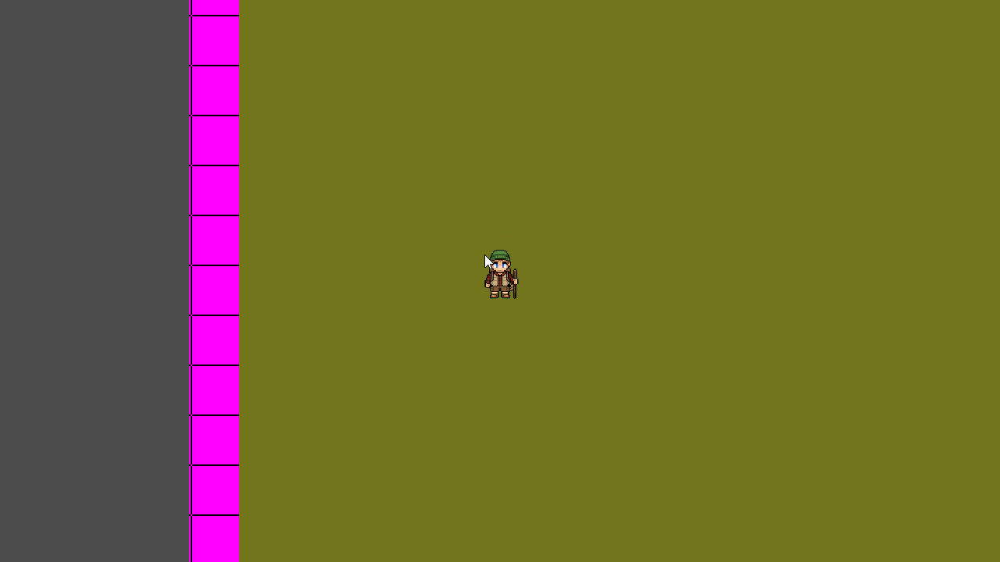

# 3 April 2026

## Previously...

Codex created a simple Godot game where the player was a blue square that could
move around in a box bounded by pink squares that acted as walls.

## Over the last couple days...

The pink squares are still here, but I managed to load a TileSet and use it to
make a (simple) TileMap.

Codex one-shot transformed the blue square into an animated sprite that Nano
Banana made based on a charas example spritesheet. I also made a Dryad
spritesheet.

## To Do

- Find that tileset asset on itch.io to give proper credit
- Fix hiker spritesheet. There's a number of problems with it:
  - Faces wrong direction on one frame of up
  - Walking stick switches hands
  - Black artifacts on upper boundary on some frames
  - Etc.
